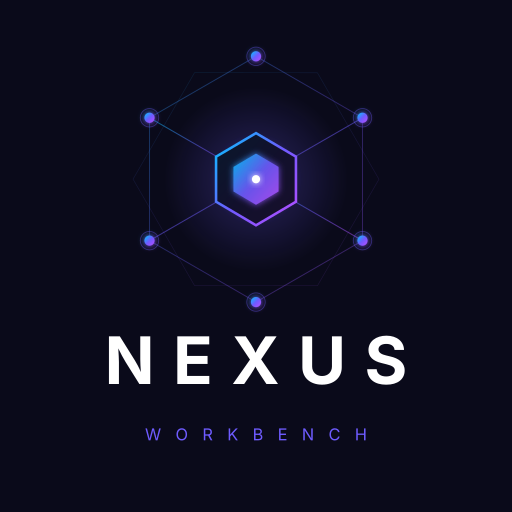

<div align="center">



# ⚡ NEXUS

**你的个人 AI 工作台 · 把「收件箱 · 知识库 · 文档工厂 · 研究 · 量化 · 学习」全部装进一个可部署的本地优先系统**

[](LICENSE)
[](requirements.txt)
[](requirements.txt)
[](desktop/package.json)
[](#-测试)
[](CONTRIBUTING.md)

> **AI 不是聊天框，是你的工作流。** NEXUS 把真实工具执行、Agent 调度、证据回放、多项目入口，做成了一个你可以自己部署、自己掌控数据的系统。

</div>

---

## 🌟 为什么是 NEXUS？

| | 聊天机器人 | NEXUS |
|---|---|---|
| 🤖 能力边界 | 只会"说" | **真工具执行 + 证据回放**，说和做一致 |
| 🧩 功能形态 | 单线程对话 | **12+ 可插拔项目入口**，收件箱/知识库/研究/量化/学习一体 |
| 🔁 跨任务协作 | 每次从零开始 | **父 Agent 调度 + 子 Agent 分工**，跨项目交接有记录 |
| 🔒 数据主权 | 全在云端 | **本地优先**，SQLite + 你的磁盘，`.env` 永远不上传 |
| 🖥️ 入口形态 | 网页 | 网页 + **Electron 桌面壳**（标签页/自动登录/浏览器沙箱） |

---

## 🧩 12+ 个开箱即用的项目

| 项目 | 做什么 |
|---|---|
| 📥 **快速收件箱** | 7 类自动分类、合并建议、批量整理，不放过任何一条输入 |
| 📚 **本地知识库** | Markdown + 关键词/语义向量混合检索，Obsidian 兼容 |
| 📄 **文档工厂** | PDF/Word/Excel/PPTX/HTML/MD → 结构化产物，DOCX/PDF 交付审批 |
| 🔬 **网页研究** | 多上下文 AI 研究、来源证据、追问、产物交接 |
| 📈 **量化选股** | 可解释因子、观察任务、日报/周报、回测（**不自动下单**） |
| 🖥️ **服务器监控** | SSH/本机只读探测、阈值告警、历史快照、健康评分 |
| 🔥 **AI 热点研究** | 多数据源洞察、Web Push 摘要推送 |
| 🎓 **AI 转型学习** | 每日知识 + 练习自测 + **AI 批改** + 定时推送 |
| 💡 **想法分析** | 结构化验证、证据/指标回填、继续/暂停/转向 |
| 📦 **产品作战室** | 反馈证据、需求池、RICE 优先级、决策记录、PRD 生成 |
| 🛠️ **受控云开发** | 白名单工作区 + 固定配方命令 + 构建审批（**不接受任意 shell**） |
| ⚡ **自动化中心** | 规则目录、多步骤计划、重试与人工接管 |

> 项目可插拔：改一行 `projects.json` 就能开/关入口，禁用后首页、Agent 工具、调度路由统一消失。

---

## 🏗️ 架构

```
┌────────────────────────────────────────────────────────┐
│                      Electron 桌面壳                     │
│       标签页 · Basic Auth 自动登录 · 浏览器安全沙箱        │
└──────────────────────────┬─────────────────────────────┘
                           │ HTTPS
┌──────────────────────────▼─────────────────────────────┐
│                     FastAPI (app.py)                    │
│  ┌───────────────────────────────────────────────────┐ │
│  │              🤖 总调度 Agent（父 Agent）           │ │
│  │    ReAct function calling · 子 Agent 分工 · 证据回放 │ │
│  └───────────────────────────────────────────────────┘ │
│  ┌──────┬──────┬──────┬──────┬──────┬──────┬────────┐  │
│  │收件箱 │知识库│文档工厂│研究  │量化  │监控  │ 学习   │  │
│  └──────┴──────┴──────┴──────┴──────┴──────┴────────┘  │
│  app_pkg/ · 35 个领域模块 · SQLite · 本地优先             │
└──────────┬──────────────────────────────┬──────────────┘
           │                              │
    knowledge-base/ outputs/     外部集成（飞书 / WebPush / SSH 只读）
```

- **真 Agent**：所有子 Agent 走函数调用，执行结果回放给你看，不是"看起来像 LLM 对话"
- **多 Provider failover**：主配置优先，失败自动切 fallback，环境变量最后兜底
- **交接有痕**：跨项目协作通过 `/api/handoffs` 记录到 `work_items`

---

## 🚀 快速开始（3 分钟跑起来）

```bash
# 1. 克隆
git clone https://github.com/Hunterleeeee/nexus-workbench.git && cd nexus-workbench

# 2. 装依赖
python3 -m venv .venv && source .venv/bin/activate
pip install -r requirements.txt

# 3. 配置 LLM（任意 OpenAI 兼容接口）
cp .env.example .env   # 填 LLM_API_KEY / LLM_BASE_URL / LLM_MODEL

# 4. 启动
.venv/bin/python -m uvicorn app:app --host 127.0.0.1 --port 8765
```

打开 <http://127.0.0.1:8765>，**开箱即用**（没有 `projects.json` 时自动回退到开源模板，无需手动配置）。

### 🖥️ 桌面壳（可选）

```bash
cd desktop && npm install
npm start          # 启动壳
npm run verify     # 静态门禁（版本/安全边界/PWA 对齐）
npm run package    # 打包 macOS 安装包
```

---

## 🔒 安全设计（认真对待，不是口号）

- `.env` / 数据库 / 个人知识库 / 运行快照 **一律不进版本库**
- 云开发：白名单工作区 + 固定配方 + `shell=False`，**没有任意 shell**
- 浏览器项目：只能访问公开 URL，工作台自身永远不能成为目标
- 服务器监控：**只读探测**，日志读取和重启必须人工确认
- 桌面壳：contextIsolation + Node 禁用 + 沙箱 + 证书校验不豁免
- 模型输出错误不会白跑：降级策略保底，内容永远不丢

---

## 🧪 测试

```bash
.venv/bin/python -m pytest tests/ -q
# ✅ 494 passed, 3 skipped, 58 subtests
```

前端与桌面壳门禁：

```bash
cd desktop && npm ci && npm run verify && npm run test:frontend
```

---

## 📁 仓库结构

```
nexus-workbench/
├── app.py                 # FastAPI 主应用（uvicorn 入口）
├── app_pkg/               # 35 个领域模块（inbox/knowledge/market/server/…）
├── agent_worker.py        # Agent 调度后台 Worker（独立进程）
├── crawl_worker.py        # 网页抓取 Worker
├── monitor_worker.py      # 服务器监控 Worker
├── sync_worker.py         # 数据同步 Worker
├── browser_*_worker.py    # 浏览器渲染/会话 Worker（按需）
├── static/                # 工作台与各项目页面资源
├── desktop/               # Electron 桌面壳
├── tests/                 # 测试套件（pytest）
├── scripts/               # 工具脚本（VAPID 密钥生成等）
├── projects.open-source.json  # 开源默认项目配置（缺失自动回退）
├── data/                  # SQLite / 快照（仅 .gitkeep 入库）
└── knowledge-base/        # 运行时 Markdown 知识库（仅 README 入库）
```

---

## 🗺️ Roadmap

- [ ] GitHub Actions CI（测试 + verify 自动跑）
- [ ] Docker 一键部署（含 Nginx + systemd 模板）
- [ ] 网页版 PWA 桌面通知
- [ ] 更多项目入口（邮件、RSS、CRM 集成）

---

## 🤝 贡献

欢迎 PR 和 Issue！请先读 [CONTRIBUTING.md](CONTRIBUTING.md)，提交信息沿用 `版本号：改动摘要` 约定。

## 📄 License

[MIT](LICENSE) — 自由使用、修改、分发。

---

<div align="center">

**NEXUS · 你的工作台，你说了算**

<sub>Built with FastAPI · Electron · SQLite · 本地优先</sub>

</div>
